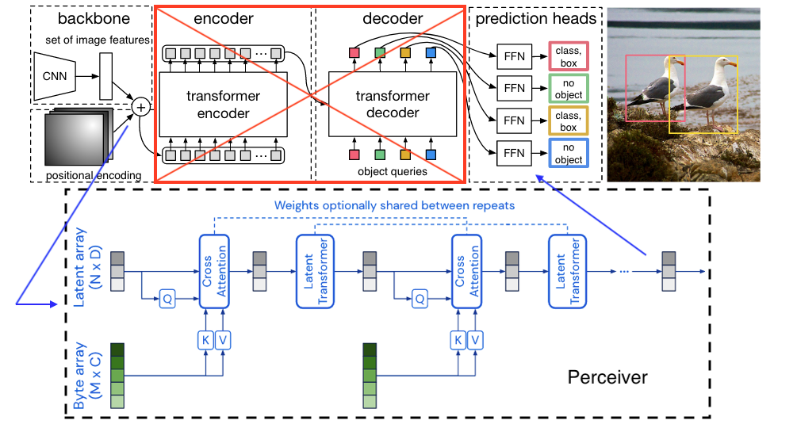

**Detection Perceiver**: End-to-End Object Detection with Transformers
========

[](https://opensource.fb.com/support-ukraine)

PyTorch training code and pretrained models for **DePerceiver** (**DE**tection Perceiver).
We replace the full complex hand-crafted object detection pipeline with a Transformer, and match Faster R-CNN with a ResNet-50, 
obtaining **29 AP** on COCO.



**What it is**. We adopted the DETR approach of training a transformer model for object detection. Unlike traditional computer vision techniques, DETR approaches object detection as a direct set prediction problem. 
We implemented own experiment to train a DePerceiver model on COCO dataset for object detection. 
Experiment consists of a set-based global loss, which forces unique predictions via bipartite matching, and a Perceiver encoder architecture.

# Model

|   | name              | backbone | schedule | inf_time | box AP | url                                                                                                                                                                                               | parameters |
|---|-------------------|----------|----------|----------|--------|---------------------------------------------------------------------------------------------------------------------------------------------------------------------------------------------------|------------|
| 0 | DETR              | R50      | 500      | 0.036    | 42.0   | [model](https://dl.fbaipublicfiles.com/detr/detr-r50-e632da11.pth)&nbsp;&nbsp;[logs](https://dl.fbaipublicfiles.com/detr/logs/detr-r50_log.txt)                                                   | 41M        |
| 1 | DePerceiver (our) | R50      | 150      | n/a      | 29.2   | [model](https://huggingface.co/Max-Ploter/DePerceiver)&nbsp;&nbsp;[logs](./de_perceiver_r50/log.txt)                                                                                              | 42M        |

# Notebooks

We provide a few notebooks in colab to help you get a grasp on DETR:
* [DePerceiver hands on Colab Notebook](notebooks/de_perceiver_hands_on.ipynb): Shows how to load a model from hf hub, generate predictions, then visualize the attention of the model


# Usage - Object detection
We provide instructions how to install dependencies via conda.

Then, install PyTorch 1.5+ and torchvision 0.6+:
```
conda install -c pytorch pytorch torchvision
```
Install:

```
conda install cython scipy
conda install conda-forge::einops
conda install conda-forge::pycocotools
pip install perceiver-pytorch==0.8.8
pip install ipywidgets
pip install pandas
pip install seaborn
```

## Data preparation

Download and extract COCO 2017 train and val images with annotations from
[http://cocodataset.org](http://cocodataset.org/#download).
We expect the directory structure to be the following:
```
path/to/coco/
  annotations/  # annotation json files
  train2017/    # train images
  val2017/      # val images
```

# Train in Google Vertex AI

Build docker image and push to registry:
```
gcloud builds submit --config cloudbuild.yaml
```

Edit script [create-gc-custom-job-train.sh.dev](create-gc-custom-job-train.sh.dev) by removing file name `.dev` 
suffix adjusting docker image version URI, changing machine specification and experiment arguments.

```
# Run training from scratch
./create-gc-custom-job-train.sh --name my_job_name
# Result training from latest checkpoint
./create-gc-custom-job-train.sh --name my_job_name --output /path/to/output
```

# Acknowledgments

* [detr](https://github.com/facebookresearch/detr) by Facebook Research

# Contributing
We actively welcome your pull requests! Please see [CONTRIBUTING.md](.github/CONTRIBUTING.md) and [CODE_OF_CONDUCT.md](.github/CODE_OF_CONDUCT.md) for more info.
